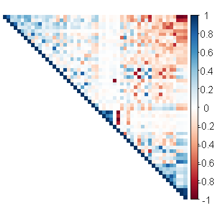
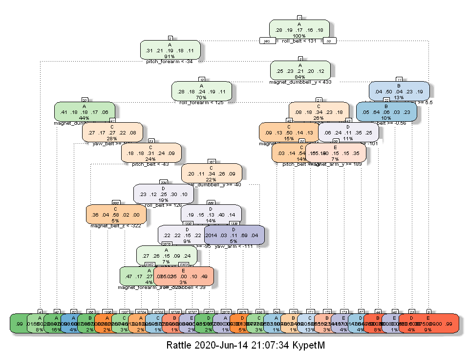
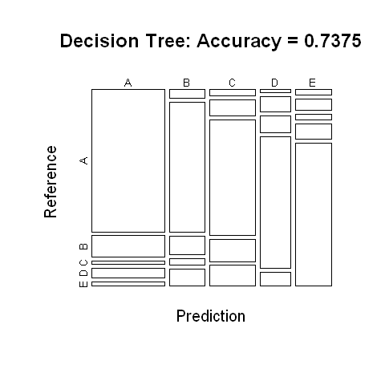
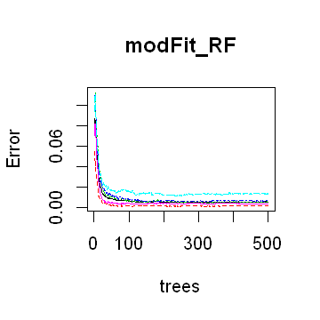
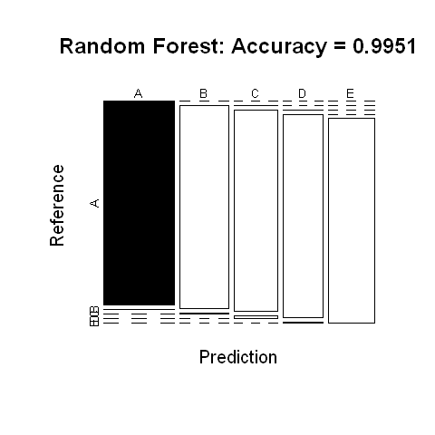
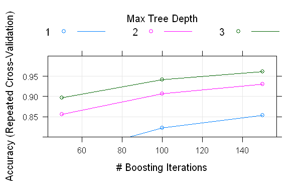

**<left><font size='6' color='#000000' >Coursera - Practical Machine Learning - Project</font></left>** <br>
_<font size='3' color='#000000' style='italic' >Milan Kypet</font>_

# <font color="DarkMagenta"> Introduction </font>

This is the final project of the Coursera's course Practical Machine Learning, which was developed in Jupyter Notebook. <br>
The aim of this study is to predict the manner in which six young healthy participants perform particular exercises with dumbbells. 
In order to built some machine learning algorithms, we will employ a training data file in which the related outcome variable is marked as **classe**. The class A corresponds to the specified execution of the exercise, while the other 4 classes correspond to common mistakes.
Finally, we select the best model for predicting 20 different test cases.

### <font color="SteelBlue"> Background </font>

Using devices such as Jawbone Up, Nike FuelBand, and Fitbit it is now possible to collect a large amount of data about personal activity relatively inexpensively. These type of devices are part of the quantified self movement – a group of enthusiasts who take measurements about themselves regularly to improve their health, to find patterns in their behavior, or because they are tech geeks. One thing that people regularly do is quantify how much of a particular activity they do, but they rarely quantify how well they do it. <br>
In this project, your goal will be to use data from accelerometers on the belt, forearm, arm, and dumbell of 6 participants. They were asked to perform barbell lifts correctly and incorrectly in 5 different ways. More information is available from the website here: http://groupware.les.inf.puc-rio.br/har (see the section on the Weight Lifting Exercise Dataset).

# <font color="DarkMagenta"> Exploratory Data Analysis </font>

### <font color="SteelBlue"> Packages and Data Source </font>


```R
# Settings
options(warn=-1)
set.seed(321)
```


```R
# Libraries
library("ggplot2")
library("lattice")
library("repr")
library("caret")
library("rpart")
library("corrplot")
library("rattle")
library("randomForest")
library("gbm")
```


```R
# Input Data
Raw_DataSet = read.csv("C:/Users/kypetm/_ML/data/Coursera/pml-training.csv", header = T)
validation = read.csv("C:/Users/kypetm/_ML/data/Coursera/pml-testing.csv", header = T)

dim(Raw_DataSet)
dim(validation)
```


<ol class=list-inline>
	<li>19622</li>
	<li>160</li>
</ol>


<ol class=list-inline>
	<li>20</li>
	<li>160</li>
</ol>


The Raw DataSet consists of almost 20K records and **160** variables. 


```R
head(Raw_DataSet)
```

### <font color="SteelBlue"> Data Cleaning and Preprocessing</font>


```R
# Missing Values
sum(sapply(names(Raw_DataSet), function(x) mean(is.na(Raw_DataSet[,x])) < 0.9))
sum(sapply(names(Raw_DataSet), function(x) mean(is.na(Raw_DataSet[,x])) == 0))
Raw_DataSet <- Raw_DataSet[, colSums(is.na(Raw_DataSet)) == 0]
```


93


93


Since all variables that contain any missing value have only a small portion of the relevant values so we can remove all these variables.


```R
# Removing unnecessary variables for this analysis  
Raw_DataSet <- Raw_DataSet[, -c(1:7)]
```


```R
# Spliting the data into Training and Testing sets
inTrain <- createDataPartition(y=Raw_DataSet$classe, p=0.70, list=FALSE)

training <- Raw_DataSet[inTrain,]
testing <- Raw_DataSet[-inTrain,]
```


```R
# Removing zero covariates
nzv <- nearZeroVar(training)
training <- training[, -nzv]
testing <- testing[, -nzv]
dim(training)
```


<ol class=list-inline>
	<li>13737</li>
	<li>53</li>
</ol>


In this section, we have reduced the number of variables, so our final training set has **53**.


```R
# Correlation Matrix
options(repr.plot.width=3, repr.plot.height=3)
cm <- cor(training[, -53])
corrplot(cm, order="FPC", method="color", type="upper", tl.pos='n', tl.col=rgb(0, 0, 0))
```





The variables in dark colors are highly correlated (blue for positive, red for negative), because there are not many of these cases, we do not need to make further data adjustment.

# <font color="DarkMagenta"> Model building </font>

### <font color="SteelBlue"> Prediction with Decision Tree</font>


```R
# Model Fitting
set.seed(321)
modFit_DT <- rpart(classe ~ ., data=training, method="class")
options(repr.plot.width=8, repr.plot.height=6)
fancyRpartPlot(modFit_DT, cex=0.5)
```





```R
# Predictions
prediction_DT <- predict(modFit_DT, testing, type="class")
CM_DT <- confusionMatrix(prediction_DT, testing$classe)
CM_DT
```


    Confusion Matrix and Statistics
    
              Reference
    Prediction    A    B    C    D    E
             A 1538  231   35  106   43
             B   48  670   95   36   87
             C   43  110  790  151  140
             D   14   71   74  592   62
             E   31   57   32   79  750
    
    Overall Statistics
                                             
                   Accuracy : 0.7375         
                     95% CI : (0.726, 0.7487)
        No Information Rate : 0.2845         
        P-Value [Acc > NIR] : < 2.2e-16      
                                             
                      Kappa : 0.666          
                                             
     Mcnemar's Test P-Value : < 2.2e-16      
    
    Statistics by Class:
    
                         Class: A Class: B Class: C Class: D Class: E
    Sensitivity            0.9188   0.5882   0.7700   0.6141   0.6932
    Specificity            0.9014   0.9440   0.9086   0.9551   0.9586
    Pos Pred Value         0.7875   0.7158   0.6402   0.7282   0.7903
    Neg Pred Value         0.9654   0.9052   0.9493   0.9267   0.9327
    Prevalence             0.2845   0.1935   0.1743   0.1638   0.1839
    Detection Rate         0.2613   0.1138   0.1342   0.1006   0.1274
    Detection Prevalence   0.3319   0.1590   0.2097   0.1381   0.1613
    Balanced Accuracy      0.9101   0.7661   0.8393   0.7846   0.8259


```R
# Confusion Matrix - plot
options(repr.plot.width=4, repr.plot.height=4)
plot(CM_DT$table, col=CM_DT$byClass, main=paste("Decision Tree: Accuracy =",
                                                round(CM_DT$overall['Accuracy'], 4)))
```





### <font color="SteelBlue"> Prediction with Random Forest</font>


```R
# Model Fitting
set.seed(321)
modFit_RF <- randomForest(classe ~ ., data=training)
modFit_RF
```


    
    Call:
     randomForest(formula = classe ~ ., data = training) 
                   Type of random forest: classification
                         Number of trees: 500
    No. of variables tried at each split: 7
    
            OOB estimate of  error rate: 0.52%
    Confusion matrix:
         A    B    C    D    E class.error
    A 3900    5    0    1    0 0.001536098
    B   10 2646    2    0    0 0.004514673
    C    0   14 2380    2    0 0.006677796
    D    0    1   26 2223    2 0.012877442
    E    0    0    3    5 2517 0.003168317


```R
options(repr.plot.width=3, repr.plot.height=3)
plot(modFit_RF)
```





```R
# Predictions
prediction_RF <- predict(modFit_RF, testing, type="class")
CM_RF <- confusionMatrix(prediction_RF, testing$classe)
CM_RF
```


    Confusion Matrix and Statistics
    
              Reference
    Prediction    A    B    C    D    E
             A 1674    1    0    0    0
             B    0 1136    8    0    0
             C    0    2 1017   13    0
             D    0    0    1  951    4
             E    0    0    0    0 1078
    
    Overall Statistics
                                              
                   Accuracy : 0.9951          
                     95% CI : (0.9929, 0.9967)
        No Information Rate : 0.2845          
        P-Value [Acc > NIR] : < 2.2e-16       
                                              
                      Kappa : 0.9938          
                                              
     Mcnemar's Test P-Value : NA              
    
    Statistics by Class:
    
                         Class: A Class: B Class: C Class: D Class: E
    Sensitivity            1.0000   0.9974   0.9912   0.9865   0.9963
    Specificity            0.9998   0.9983   0.9969   0.9990   1.0000
    Pos Pred Value         0.9994   0.9930   0.9855   0.9948   1.0000
    Neg Pred Value         1.0000   0.9994   0.9981   0.9974   0.9992
    Prevalence             0.2845   0.1935   0.1743   0.1638   0.1839
    Detection Rate         0.2845   0.1930   0.1728   0.1616   0.1832
    Detection Prevalence   0.2846   0.1944   0.1754   0.1624   0.1832
    Balanced Accuracy      0.9999   0.9978   0.9941   0.9927   0.9982


```R
# Confusion Matrix - plot
options(repr.plot.width=4, repr.plot.height=4)
plot(CM_RF$table, col=CM_RF$byClass, main=paste("Random Forest: Accuracy =",
                                                round(CM_RF$overall['Accuracy'], 4)))
```





### <font color="SteelBlue"> Prediction with Generalized Boosted Model</font>


```R
# Model Fitting
set.seed(321)
modFit_GBM <- train(classe ~ ., data=training, method="gbm", verbose=FALSE,
                    trControl = trainControl(method="repeatedcv", number=5, repeats=1))
modFit_GBM$finalModel
```


    A gradient boosted model with multinomial loss function.
    150 iterations were performed.
    There were 52 predictors of which 52 had non-zero influence.


```R
options(repr.plot.width=5, repr.plot.height=3)
plot(modFit_GBM, ylim=c(0.8, 1))
```





```R
# Predictions
prediction_GBM <- predict(modFit_GBM, testing)
CM_GBM <- confusionMatrix(prediction_GBM, testing$classe)
CM_GBM
```


    Confusion Matrix and Statistics
    
              Reference
    Prediction    A    B    C    D    E
             A 1649   30    0    2    5
             B   19 1071   33    3   18
             C    4   34  970   31   14
             D    2    4   19  924   14
             E    0    0    4    4 1031
    
    Overall Statistics
                                              
                   Accuracy : 0.9592          
                     95% CI : (0.9538, 0.9641)
        No Information Rate : 0.2845          
        P-Value [Acc > NIR] : < 2.2e-16       
                                              
                      Kappa : 0.9484          
                                              
     Mcnemar's Test P-Value : 3.854e-06       
    
    Statistics by Class:
    
                         Class: A Class: B Class: C Class: D Class: E
    Sensitivity            0.9851   0.9403   0.9454   0.9585   0.9529
    Specificity            0.9912   0.9846   0.9829   0.9921   0.9983
    Pos Pred Value         0.9781   0.9362   0.9212   0.9595   0.9923
    Neg Pred Value         0.9940   0.9857   0.9884   0.9919   0.9895
    Prevalence             0.2845   0.1935   0.1743   0.1638   0.1839
    Detection Rate         0.2802   0.1820   0.1648   0.1570   0.1752
    Detection Prevalence   0.2865   0.1944   0.1789   0.1636   0.1766
    Balanced Accuracy      0.9881   0.9625   0.9642   0.9753   0.9756


# <font color="DarkMagenta"> Model Validation </font>

We have just created three different models that achieve the following accuracy in the prediction on the testing data set:
- Decision Tree: 73.75%
- Random Forests: **99.51%**
- Generalized Boosted Model: 95.92% 

Obviously, the Random Forest method gives us the best results in terms of the lowest out-of-sample-error, which is 0.49%. <br>
Therefore, we will use the Random Forest model to predict the outcome variable classe on the validation data (quiz) as shown below.


```R
prediction_Final <- predict(modFit_RF, validation, type="class")
print(prediction_Final)
```

     1  2  3  4  5  6  7  8  9 10 11 12 13 14 15 16 17 18 19 20 
     B  A  B  A  A  E  D  B  A  A  B  C  B  A  E  E  A  B  B  B 
    Levels: A B C D E
    
